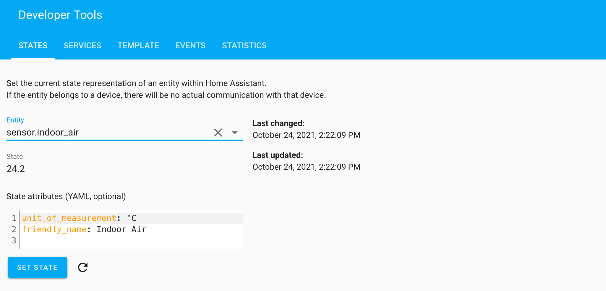
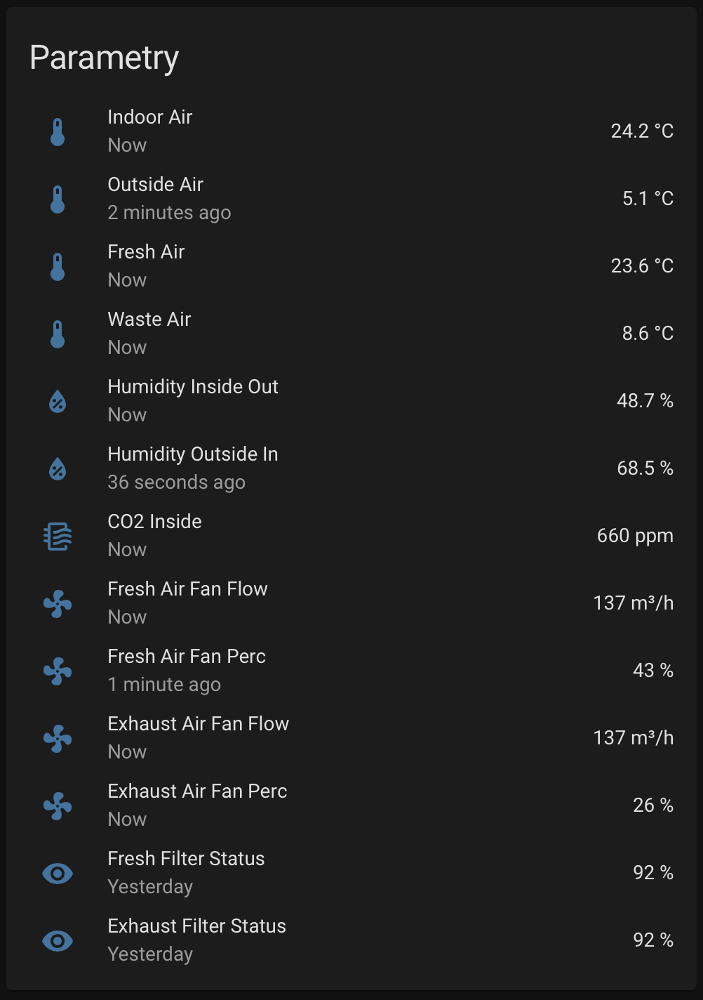

# Wafe 350EFS2 via ModBus/TCP for Homeassistant #
Configuration, action scripts and lovelace cards source codes.

## Preface ##
[Wafe 350EFS2](https://www.wafe.eu/en/product/wafe-350-efs2) is standalone recuperation unit driven by RasPi controller with [ModBus](Wafe350EFS2-ModBus-commands.tsv "ModBus Commnds List"). 
Unit can be controlled by [online web application](https://www.wafe.eu/en/product/mywafe).

## Solution ##
Homeassistant can communicate with [ModBus protocol](https://www.home-assistant.io/integrations/modbus/). Homeassistant can easily connect via TCP protocol and interface can be easily configured for given unit.

## Software setup ##
Software setup is very easy:
1. Copy `src/configuration.yaml` to homeassistant configuration file a set `host` to your local IP address of Wafe350 unit.
```
modbus:
  - name: Wafe
    type: tcp
    host: 10.0.0.76
    port: 502
```
2. Copy `src/scripts.yaml` to homeassistant scripts file.
3. Check syntax of configuration file and restart homeassistant.


4. Check `Developer Tools` to unsure that sensors work properly.



5. Configure lovelace card as usual, for exaqmple:
```
type: vertical-stack
cards:
  - type: horizontal-stack
    cards:
      - type: entity
        entity: sensor.indoor_air
        name: Inside
      - type: entity
        entity: sensor.outside_air
        name: Outside
  - type: horizontal-stack
    cards:
      - type: gauge
        entity: sensor.humidity_inside_out
        min: 0
        max: 100
        name: Humidity
        severity:
          green: 40
          yellow: 60
          red: 80
      - type: gauge
        entity: sensor.fresh_air_fan_perc
        min: 0
        max: 100
        name: Ventilation
        severity:
          green: 30
          yellow: 60
          red: 90
      - type: gauge
        entity: sensor.co2_inside
        min: 0
        max: 2000
        severity:
          green: 500
          yellow: 1000
          red: 1500
        name: CO2
```


## Lovelace Cards ##
Now you are ready to configure custom cards, using sensors, binary sensors and action scripts to controll recuperation unit modes.

### Overview ###
Overview card with all available input sensors:
```
type: entities
entities:
  - entity: sensor.indoor_air
    secondary_info: last-updated
  - entity: sensor.outside_air
    secondary_info: last-updated
  - entity: sensor.fresh_air
    secondary_info: last-updated
  - entity: sensor.waste_air
    secondary_info: last-updated
  - entity: sensor.humidity_inside_out
    icon: hass:water-percent
    secondary_info: last-updated
  - entity: sensor.humidity_outside_in
    icon: hass:water-percent
    secondary_info: last-updated
  - entity: sensor.co2_inside
    icon: hass:air-filter
    secondary_info: last-updated
  - entity: sensor.fresh_air_fan_flow
    icon: hass:fan
    secondary_info: last-updated
  - entity: sensor.fresh_air_fan_perc
    icon: hass:fan
    secondary_info: last-updated
  - entity: sensor.exhaust_air_fan_flow
    icon: hass:fan
    secondary_info: last-updated
  - entity: sensor.exhaust_air_fan_perc
    icon: hass:fan
    secondary_info: last-updated
  - entity: sensor.fresh_filter_status
    secondary_info: last-updated
  - entity: sensor.exhaust_filter_status
    secondary_info: last-updated
title: Params
state_color: true
show_header_toggle: false
```

 

